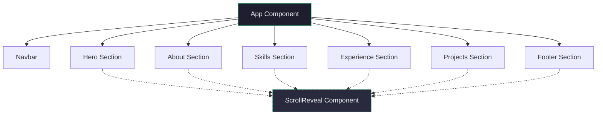

# Deepak Tiwari - Personal Portfolio

A modern, responsive, and visually stunning personal portfolio for Deepak Tiwari, a Frontend Developer based in Mumbai. Built with modern web technologies, this portfolio features smooth scroll animations, a custom particle background, and a clean, user-centric design.

## 🚀 Features

- **Dynamic Hero Section:** Interactive particle background with an elegant introduction.
- **Scroll Animations:** Smooth fade-up reveals triggered on scroll using Framer Motion (`motion/react`).
- **Interactive UI Elements:** Custom animated hamburger menu, floating project previews, and hover micro-interactions.
- **Responsive Design:** Fully responsive layout that looks great on mobile, tablet, and desktop devices.
- **Modern Tech Stack:** Built using React, Vite, and Framer Motion.

## 🛠️ Tech Stack

- **Framework:** [React 18](https://react.dev/)
- **Build Tool:** [Vite 6](https://vitejs.dev/)
- **Animations:** [Framer Motion](https://motion.dev/)
- **Icons:** [Lucide React](https://lucide.dev/)
- **Styling:** Custom CSS with modern layout techniques (CSS Grid, Flexbox) and dynamic inline styling.

## 🏗️ Architecture & Component Tree

The application is structured sequentially as a single-page scrolling site. `ScrollReveal` is a reusable wrapper used across multiple sections for consistent scroll-triggered animations.



## 💻 Local Development Setup

Follow these steps to run the portfolio locally on your machine.

### Prerequisites

- [Node.js](https://nodejs.org/) (v18 or higher recommended)
- `npm` (comes with Node.js)

### Installation

1. **Clone the repository** (if applicable) or navigate to the project directory:
   ```bash
   cd Personal-Portfolio
   ```

2. **Install dependencies:**
   ```bash
   npm install
   ```

3. **Start the development server:**
   ```bash
   npm run dev
   ```

4. **Open in Browser:**
   The development server will usually start at `http://localhost:5173`. Open this URL in your browser to view the application.

### Building for Production

To create a production-ready build:

```bash
npm run build
```

The optimized files will be generated in the `dist` directory, ready to be deployed to platforms like Vercel, Netlify, or GitHub Pages.

## 📧 Contact

**Deepak Tiwari**
- **Email:** deepak.tiwari.engineer@gmail.com
- **LinkedIn:** [linkedin.com/in/deepak-tiwarrri](https://linkedin.com/in/deepak-tiwarrri)
- **GitHub:** [github.com/deepak-tiwarrri](https://github.com/deepak-tiwarrri)

---
*Designed & built with ❤️ by Deepak Tiwari*